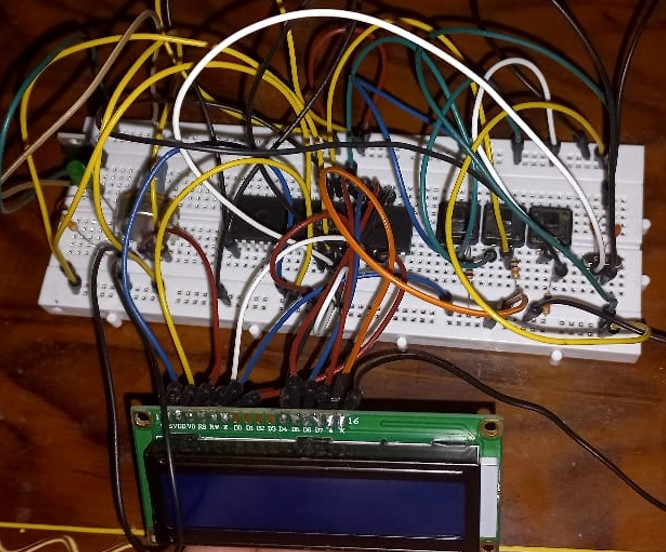

# stopwatch project
## used components
- PIC16F877a
- LCD 16*2 
- 3 push buttons
- wires
- resistance 380 ohm
- Electronic LED
- voltage regulator
- 9V battery
- Breadboard
- Crystal 8 MHz
- two 22pF Capacitors
-----------------------------------------------------------------------------------------------

## **images**
- *real image*

